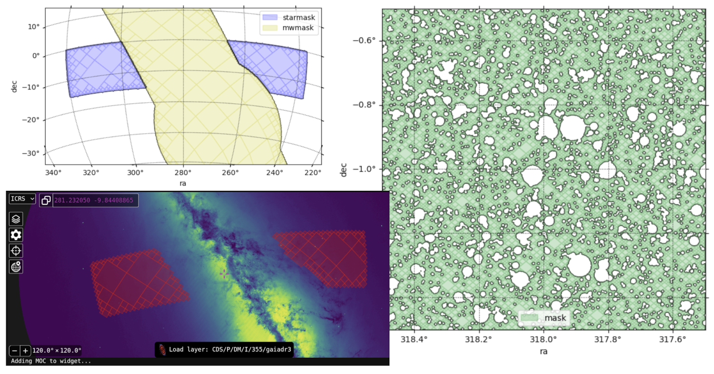
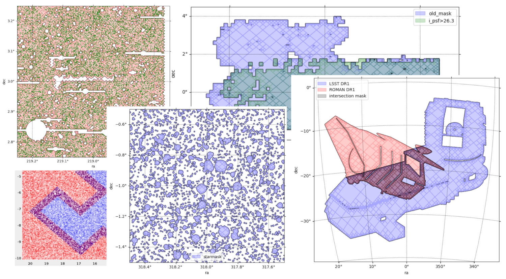

# 
---
## **Cutting pixelized sky masks in a pipeline way**
---
**Skykatana** is a pacakge to create and maniputate boolean spatial masks on the
celestial sphere, by combining [healsparse](https://github.com/LSSTDESC/healsparse) pixel maps
accounting for various effects such as cutting out regions around bright stars, low depth, bad
seeing, extended sources, among others. We call these partial maps **stages**, which are then
combined into a final mask.

For each stage you can generate random points, quickly visualize masks, do plots overlaying
bright stars, and apply the mask to an arbitrary catalog to select sources located inside.

It has been designed to produce masks for large 8-meter surveys such as the upcoming half-sky 
dataset of the [Vera Rubin Observatory](https://rubinobservatory.org/) and the [HSC-SSP survey](https://hsc-release.mtk.nao.ac.jp/doc/).
It can handle multi-billion pixel masks with very limited memory resources and is flexible to 
accomodate custom recipes for masking different objects.  **Skykatana** also implements a fast
GPU cone pixelixer algorithm to speed up processing millions of stars from large catalogs like Gaia.

Main Class
-------------
* ``SkyMaskPipe()``
    Main class for assembling and handling pixelized masks

Main Methods
-------------
* ``build_footprint_mask(), build_circ_mask(), buld_propmap_mask(), build_star_mask_online(), etc``
    --> Generate maps for each stage from discrete sources, geometric shapes or other healsparse maps
* ``combine()``
    --> Merge the maps created above to generate a new mask
* ``plot()``
    --> Visualize a mask stage by plotting randoms. Options to zoom, oveplot stars, etc.
* ``plot_moc()``
    --> Visualize a mask stage by plotting its MOC (multiorder coverage map).
* ``makerans()``
    --> Generate randoms over a mask stage
* ``apply()``
    --> Cut out sources outside of a given mask stage

Dependencies
------------
* [lsdb](https://github.com/astronomy-commons/lsdb), [healsparse](https://github.com/LSSTDESC/healsparse),
[tqdm](https://github.com/tqdm/tqdm), [healpy](https://github.com/healpy/healpy), [fitsio](https://github.com/esheldon/fitsio), 
[ipyaladin](https://github.com/cds-astro/ipyaladin), [pillow](https://github.com/python-pillow/Pillow)
* Optional GPU pixelizer : [numba](https://numba.pydata.org/) + CUDA , [cupy](https://cupy.dev/)

Install
-------
### CPU-only (recommended for most users)

Install the latest release with ```pip```:

```bash
pip install skykatana
```

Or install from a local clone (editable mode is convenient for development and notebooks):

```bash
git clone https://github.com/samotracio/skykatana.git
cd skykatana
pip install -e .
```

### GPU installation (optional)

The GPU pixelizer uses **Numba CUDA + CuPy**. If you have them properly installed you are all set. If not, the most reliable 
way to install GPU support is via the provided conda environment file, which pins a CUDA runtime/toolchain that is known to work. 
**Important rule:** the CUDA runtime/toolchain used in your environment must be **<=** the CUDA version supported by your NVIDIA driver.

#### 1) Check your NVIDIA driver and CUDA support

- Run ```nvidia-smi``` and note `Driver Version: ...` and `CUDA Version: X.Y` (this is the maximum CUDA runtime supported by your driver):

- Edit `environment-gpu.yml` and make sure the conda CUDA version is **the same or lower** .

#### 2) Create the GPU conda environment

From the repo root (where `environment-gpu.yaml` lives):

```bash
conda env create -f environment-gpu.yaml
conda activate skykatana-gpu
```

#### 3) Install Skykatana (editable install)

```bash
pip install -e .
```
GPU Troubleshooting 
-------------------
If your conda CUDA environment is newer than the driver (which is often the case), you will get errors like:

- `CUDA_ERROR_UNSUPPORTED_PTX_VERSION`
- `Unsupported .version 8.8; current version is '8.6'`

Techicaly, this happens because the NVIDIA driver PTX JIT compiler is older than the PTX code that Numba generates. 
Follow the procedure above until you have matching versions. 

Example Dataset
---------------
There a small dataset of ~8 million HSC sources to start using the package. Get it [here](https://drive.google.com/file/d/1Fft9E9uD1eXs-8Dxb8bp5ou1bEtCTkgr/view?usp=sharing) 
(170 MB) and decompress it. Then, adjust the folder location in the provided notebooks and just run them. 

Documentation
-------------
* A quick tutorial notebook with HSC data is available [here](https://github.com/samotracio/skykatana/blob/main/notebooks/quick_example_hsc.ipynb)
* A tutorial notebook for building Rubin masks can be found [here](https://github.com/samotracio/skykatana/blob/main/notebooks/quick_example_rubin.ipynb)
* The full documentation and API is available [here](https://skykatana.readthedocs.io/en/latest/)

Gallery
-------



Credits
-------
* Main author: [Emilio Donoso](mailto:emiliodon@gmail.com)
* Contributors: [Mariano Dominguez](mailto:mariano.dominguez@unc.edu.ar),
[Claudio Lopez](mailto:yoclaudioantonio1@gmail.com), [Konstantin Malanchev](mailto:hombit@gmail.com)

Acknowledgements
----------------
This software was partially developed with the generous support of the [LINCC Frameworks Incubator Program](https://lsstdiscoveryalliance.org/programs/lincc-frameworks/incubators/) using LINCC resources. The [healsparse](https://github.com/LSSTDESC/healsparse) code was written by Eli Rykoff and Javier Sanchez. [mocpy](https://github.com/cds-astro/mocpy) is a fantastic library developed by the mocpy team, and [ipyaladin](https://github.com/cds-astro/ipyaladin) is a great tool to enable interactive sky visualizations.

