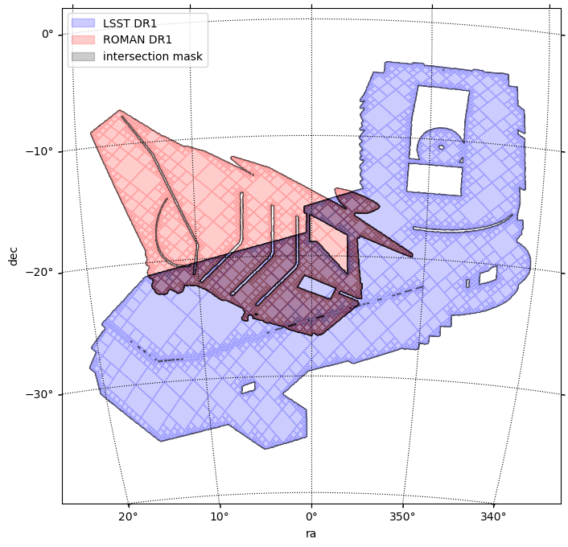
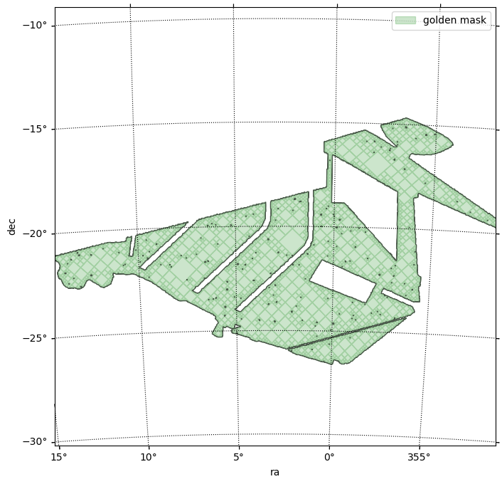
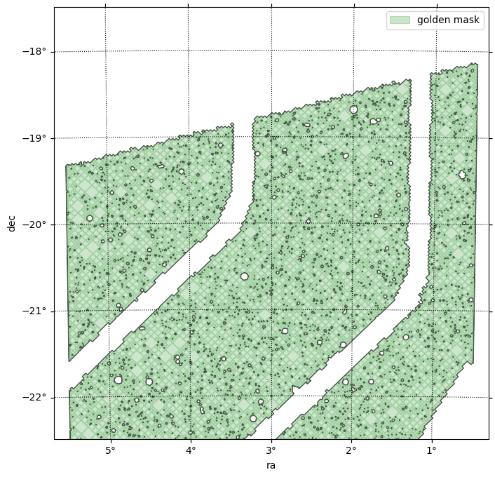

# Bonus: play with some funny masks

<span class="sc">Skykatana</span> has a funny side too. It includes algorithms to draw any picture with healpix pixels on the sky! Below, we will perform the much desired <span class='emph1'>Rubin-Roman intersection</span>:exclamation: 

```python
# Make Rubin map
rubin_map = SkyMaskPipe.image_to_healsparse("./images/rubinobs.jpg",
    order_sparse=11, order_cov=4,      # orders         
    ra0_deg=0.0, dec0_deg=-20.0,       # ra-dec of center
    width_deg=40.0, rotation_deg=0.0,  # height inferred from the image aspect ratio
    invert=True,                       # set True if the figure is dark on a bright background
    blur_radius=0.0,                   # try 1–2 px if edges are noisy
    threshold=None,                    # use Otsu; or set e.g. 128 manually
    expand_px=1,                       # dilate lines by N pixels (helps thin features)
    samples_per_pix=4,                 # nicer edges; use 1 for speed
    edge_eps=0.0,                      # small (e.g., 0.01) to slightly thicken
    chunk_size=50_000, return_bit_packed=False )
```
```
    Map generated from image -> valid pixels = 668383
```

```python
# Make Roman map
roman_map = SkyMaskPipe.image_to_healsparse("./images/roman.jpg",          #
    order_sparse=11, order_cov=4,      # orders  
    ra0_deg=7, dec0_deg=-18.0,         # ra-dec of center
    width_deg=37.0, rotation_deg=0,    # height inferred from the image aspect ratio
    invert=True,                       # set True if the figure is dark on a bright background
    blur_radius=0.0,                   # try 1–2 px if edges are noisy
    threshold=None,                    # use Otsu; or set e.g. 128 manually
    expand_px=1,                       # dilate lines by N pixels (helps thin features)
    samples_per_pix=4,                 # nicer edges; use 1 for speed
    edge_eps=0.0,                      # small (e.g., 0.01) to slightly thicken
    chunk_size=50_000, return_bit_packed=False)
```
```
    Map generated from image -> valid pixels = 280487
```

Put them in a pipeline and get intersection.

```python
funpipe = SkyMaskPipe()
funpipe.rubinmask = rubin_map
funpipe.romanmask = roman_map
funpipe.combine(positive=[('rubinmask','romanmask')], order_out=11, order_cov=4);
```
```
    [combine] aligning coverage for 'rubinmask' : c4 → c4
    [combine] aligning coverage for 'romanmask' : c4 → c4
    [combine] target=(o11, c4), work_order=11, r2=1
    [combine:&] group of 2 stages: orders=[11, 11] -> work 11
    [combine] done: order_out=11 (NSIDE=2048), order_cov=4 (NSIDE=16), valid_pix=108,602, area=89.013 deg², bit_packed=True
```

Plot their MOCs and enjoy !

```python
center = SkyCoord(0*u.deg, -20*u.deg)  ;  fov = 41*u.deg
fig, ax, wcs = funpipe.plot_moc(stage='rubinmask', center=center, fov=fov, figsize=[8,8], label='LSST DR1', color='b', order_force=11)
fig, ax, wcs = funpipe.plot_moc(stage='romanmask', center=center, fov=fov, figsize=[8,8], label='ROMAN DR1', color='r', order_force=11, ax=ax, wcs=wcs)
fig, ax, wcs = funpipe.plot_moc(stage='mask', center=center, fov=fov, figsize=[8,8], label='intersection mask', color='k', order_force=11, ax=ax, wcs=wcs)
plt.legend();
```
```
    Retrieving pixels...
    Found 668383 pixels
    Creating display moc from pixels...
    MOC max_order is 11 --> degrading forcedly to 11...
    Drawing plot...
    Retrieving pixels...
    Found 280487 pixels
    Creating display moc from pixels...
    MOC max_order is 11 --> degrading forcedly to 11...
    Drawing plot...
    Retrieving pixels...
    Found 108602 pixels
    Creating display moc from pixels...
    MOC max_order is 11 --> degrading forcedly to 11...
    Drawing plot...
```    

    
Just for the sake of practice, lets drill the holes due to stars in this precious area

```python
starq = {'search_stage': funpipe.mask,                 # The stage where we want to retrieve stars
         'cat':"https://data.lsdb.io/hats/gaia_dr3",   # URL of HATS catalog, e.g. for Gaia
         'columns':['ra','dec','phot_g_mean_mag'],     # Columns to retrieve from it
         'gaia_gmag_lims':[7,18],                      # G_band magnitude limits
         'radfunction': partial(radfunction, completeness=0.85, band='r'),  # Star radius function. Must be wrapped with partial()
         'avoid_mw': False,                            # Avoid Milky Way plane & bulge
         'b0_deg': 15.,                                # Mikly Way plane zone of exclusion from -b to b (deg)
         'bulge_a_deg': 25.,                           # Milky Way bulge semimajor axis length (deg)  
         'bulge_b_deg': 20.,                           # Milky Way bulge semiminor axis length (deg)
         'max_area_single': 400.,                         # Optional - max area to make in a single query
         'target_chunk_area': 400.,                       # Optional - target area of chunks that the search_stage is splitted into
         'coarse_order_bfs': 5                            # Optional - coarse order to perform chunking
         }
```

```python
funpipe.build_star_mask_online(starq=starq, n_threads=1);
```
```
    BUILDING STAR MASK >>>>>>>>>>>>>>>>>>>>>>>>>>>>>>>>>>>>>
    Area of search_stage  is 104.96 deg2 -> no splitting
    Chunk 1/1: querying catalog ...
    --- Stars found : 100367
    --- Pixelating circles from DataFrame
        Order :: 15 | pixelization_threads=1
        Circles to pixelate: 100367 in batches of 600000
            processing circles 0:100367 ...
    --- Star mask area                         : 12.417744948852157
```

```python
# Subtract the star mask from the previous (intersection) mask
funpipe.combine(positive=['mask'], negative=['starmask'], order_out=15, order_cov=4)
```
```
    [combine] aligning coverage for 'mask' : c4 → c4
    [combine] aligning coverage for 'starmask' : c4 → c4
    [combine] target=(o15, c4), work_order=11, r2=256
    [combine:+] stage at order 11 -> work 11
    [combine] done: order_out=15 (NSIDE=32768), order_cov=4 (NSIDE=16), valid_pix=25,137,384, area=80.481 deg², bit_packed=True
```

```python
# Plot the new golden mask!
center = SkyCoord(3*u.deg, -20*u.deg)  ;  fov = 21*u.deg
fig, ax, wcs = funpipe.plot_moc(stage='mask', center=center, fov=fov, figsize=[8,8], label='golden mask', color='g')
plt.legend();
```
```
    Retrieving pixels...
    Found 25137384 pixels
    Creating display moc from pixels...
    MOC max_order is 15 --> degrading to 11...
    Drawing plot...
```


```python
# Plot a close look to the new golden mask!
center = SkyCoord(3*u.deg, -20*u.deg)  ;  fov = 5*u.deg 
clipra = [3-0.5*5, 3+0.5*5.]
clipdec = [-20-0.5*5, -20+0.5*5]
fig, ax, wcs = funpipe.plot_moc(stage='mask', center=center, fov=fov, figsize=[8,8], label='golden mask', color='g', 
                                clipra=clipra, clipdec=clipdec)
plt.legend();
```
```
    Retrieving pixels inside clip box...
    Found 4277264 pixels
    Creating display moc from pixels...
    MOC max_order is 15 --> degrading to 13...
    Drawing plot...
```

