# Creating footprint mask from sources
This notebook provides more detailed information for creating footprint masks from the pixelization of discrete sources.
<hr class='sep1'>

## Do imports and set data path
```python
from skykatana import SkyMaskPipe
from pathlib import Path
import matplotlib.pyplot as plt
import lsdb
import astropy.units as u
from astropy.coordinates import SkyCoord
```
```python
# Define the base path for data
BASEPATH = Path('../../skykatana_example_data/example_data/')

# Input catalog (these are HSC galaxies)
HATSCAT = BASEPATH / 'hscx_minispring_gal/'
```

## Footprints for large HATS catalogs
Pixelizing large surveys such as Rubin can be time comsuming or even impossible due to the size of the catalogs. To accomodate such cases when the the data is too large to fit into memory or takes too long to process, you can distribute the task per partition (i.e. HATS pixels) among multiple workers of a Dask cluster. This is controlled with the flag `:::py3 mapping=True`.

```python
# First, create a dask cluster with 4 workers
from dask.distributed import Client
client = Client(n_workers=4, threads_per_worker=1, memory_limit="4GiB")
```

```python
# Our catalog has 11 partitions. Lets visualize them on sky
sources=lsdb.open_catalog(HATSCAT)
print('Number of partitions:', sources.npartitions)

import astropy.units as u
from astropy.coordinates import SkyCoord
center = SkyCoord(220.5*u.deg, 1*u.deg)
sources.plot_pixels(center=center, fov=[30*u.deg, 20*u.deg]);
```

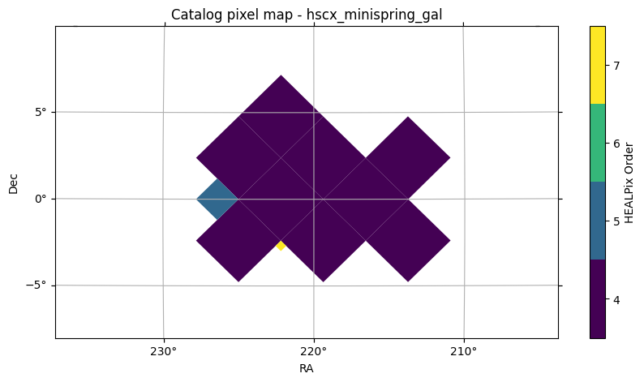


Now distribute the compute task among the available Dask workers. Data in each partition is proccesed in parallel and the 
resulting mask is collected (reduced) at the end.

```python
mkp = SkyMaskPipe(order_out=13)
mkp.build_footprint_mask(sources=sources, mapping=True)
```

    BUILDING FOOTPRINT MAP >>>>>>>>>>>>>>>>>>>>>>>>>>>>>>>>>>>>>>>>
    --- Pixelating HATS catalog
        Partitions for mapping: 11     
        Order :: 13
    --- Footprint map area                    : 69.35790724770318


Finally, do not forget to close the client
```python
client.close()
```

### 1.4 Input formats for catalogs
The method <span class='met'>build_foot_mask()</span> accepts a `:::py3 sources` keyword, which can be:

* a HATS catalog object
* a pandas dataframe or astropy table
* a path string pointing to a file (in any format readable by astropy)

## Choosing the right order
One way to create a footprint map is by pixelizing an input catalog of sources using <span class='met'>build_foot_mask()</span>. This catalog should be dense enough to prevent artificial holes but sparse enough to accurately trace boundaries and real holes. Sucha a catalog could be the parent sample from which your objects of interest were drawn. For example, if you are studying extremely red galaxies with specific color cuts in the gri bands, your input catalog could be all HSC objects classified as galaxies that have gri coverage. Sometimes, the precise sky area of a sample is not readily available or easy to obtain. In these cases, creating a footprint from a dense catalog can be a viable alternative to defining the survey boundaries.

You can customize the `:::py3 order_sparse` parameter to fine-tune this process.


```python
# Pixelize an input catalog at orders 8, 13 and 16
sources = lsdb.open_catalog(HATSCAT)
mkp_order8 = SkyMaskPipe()
mkp_order8.build_foot_mask(sources=sources, order_sparse=8);
mkp_order13 = SkyMaskPipe()
mkp_order13.build_foot_mask(sources=sources, order_sparse=13);
mkp_order16 = SkyMaskPipe()
mkp_order16.build_foot_mask(sources=sources, order_sparse=16);
```

    BUILDING FOOT MASK >>>>>>>>>>>>>>>>>>>>>>>>>>>>>>>>>>>>>>>>>>>>>>
        Order :: 8
    --- Pixelating HATS catalog
    --- Foot mask area                         : 77.63466218203293
    BUILDING FOOT MASK >>>>>>>>>>>>>>>>>>>>>>>>>>>>>>>>>>>>>>>>>>>>>>
        Order :: 13
    --- Pixelating HATS catalog
    --- Foot mask area                         : 69.35790724770318
    BUILDING FOOT MASK >>>>>>>>>>>>>>>>>>>>>>>>>>>>>>>>>>>>>>>>>>>>>>
        Order :: 16
    --- Pixelating HATS catalog
    --- Foot mask area                         : 6.444058565912096


```python
mkp_order8.plot(stage='footmask', nr=200_000, figsize=[5,3], clipra=[217,221], clipdec=[2,5])
plt.legend(["order 8"], loc='upper left')

mkp_order13.plot(stage='footmask', nr=200_000,figsize=[5,3], clipra=[217,221], clipdec=[2,5])
plt.legend(["order 13"], loc='upper left')

mkp_order16.plot(stage='footmask', nr=200_000,figsize=[5,3], clipra=[217,221], clipdec=[2,5])
plt.legend(["order 16"], loc='upper left')
```
    
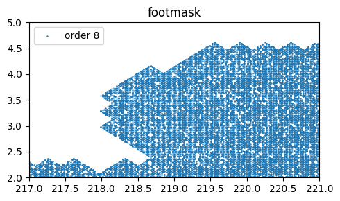
    
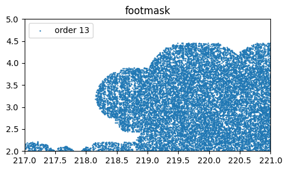
    
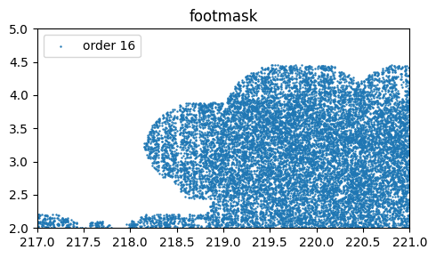

```python
# Make a zoom on the case of order 16
mkp_order16.plot(stage='footmask', nr=30_000_000, figsize=[4,4], clipra=[219,219.05], clipdec=[3.10,3.15])
plt.legend(["order 16 - zoom"], loc='upper left')
```
    
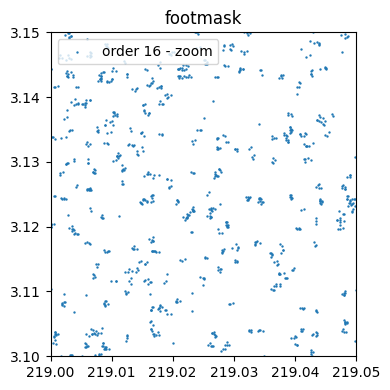

At `:::py3 order_sparse=16`, this is clearly overpizelixed and your mask is basically made of tiny pixels around the real galaxy positions whose area sums barely to ~6 deg<sup>2</sup>. As you see below, at that order the pixel size is only 3.2"


```python
mkp_order16
```
```
    footmask       : (ord/nside)cov=4/16   (ord/nside)sparse=16/65536 valid_pix=8050919  area=  6.44 deg² pix_size=   3.2"
```


## Removing isolated pixels
An isolated empty pixel is a pixel set to False surrounded by 8 True pixels. If `:::py3 order_foot` is so that you start seeing some (individual pixel) holes artificially induced, setting `:::py3 remove_isopixels=True` can detect these, and set these pixels on again (i.e. set to True).

Next, we compare two footprint maps pixelated at order=13, without and with removal of isolated pixels


```python
mkp_order13 = SkyMaskPipe()
mkp_order13.build_foot_mask(sources=sources, order_sparse=13);
```

    BUILDING FOOT MASK >>>>>>>>>>>>>>>>>>>>>>>>>>>>>>>>>>>>>>>>>>>>>>
        Order :: 13
    --- Pixelating HATS catalog
    --- Foot mask area                         : 69.35790724770318


```python
mkp_order13.plot(stage='footmask', nr=50_000_000, figsize=[4,4], clipra=[220.0,220.15], clipdec=[2.09,2.20])
plt.legend(["order 13"], loc='upper left');
```


    
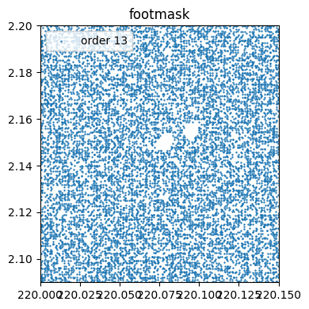
    


```python
# Remove single isolated pixels, making them part of the postive mask instead of holes
mkp_order13_noiso = SkyMaskPipe()
mkp_order13_noiso.build_foot_mask(sources=sources, order_sparse=13, remove_isopixels=True)
```

    BUILDING FOOT MASK >>>>>>>>>>>>>>>>>>>>>>>>>>>>>>>>>>>>>>>>>>>>>>
        Order :: 13
    --- Pixelating HATS catalog
        ...removing isolated pixels...
    100%|█████████████████████████████████████████████████████████████████████| 1353948/1353948 [00:08<00:00, 152522.90it/s]
    --- Foot mask area                         : 69.77740039105244


```python
mkp_order13_noiso.plot(stage='footmask', nr=50_000_000, figsize=[4,4], clipra=[220.0,220.15], clipdec=[2.09,2.20])
plt.legend(["order 13 - removeiso"], loc='upper left');
```
  
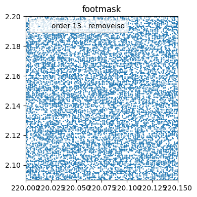
    

## Eroding borders
Since there is a pixelization involved, it is inevitable to have a certain missmatch between the real and pixelized regions, particularly along the boundaries of the survey and the boundaries of empty regions.

The keyword `:::py3 erode_borders` attempts to reduce this missmatch by detecing the pixels that delineate zones set to False (completely surrounded by pixels set to True), and set those border pixels off. This enlarges the jagged boundaries around empty regions but at the same time increases the correspondence between the pixelized areas and the real coverage in these regions.

Below we will create three maks, comparing the effect of border erosion as well as its joint effect after removing first the isolated empty pixels.


```python
mkp = SkyMaskPipe()
mkp.build_foot_mask(sources=sources)

mkp_erode = SkyMaskPipe()
mkp_erode.build_foot_mask(sources=sources, erode_borders=True)
```

    BUILDING FOOT MASK >>>>>>>>>>>>>>>>>>>>>>>>>>>>>>>>>>>>>>>>>>>>>>
        Order :: 13
    --- Pixelating HATS catalog
    --- Foot mask area                         : 69.35790724770318
    BUILDING FOOT MASK >>>>>>>>>>>>>>>>>>>>>>>>>>>>>>>>>>>>>>>>>>>>>>
        Order :: 13
    --- Pixelating HATS catalog
        ...eroding borders...
    100%|█████████████████████████████████████████████████████████████████████| 1353948/1353948 [00:06<00:00, 198531.79it/s]
    --- Foot mask area                         : 61.78044415607226

```python
mkp.plot(stage='footmask', nr=20_000_000, figsize=[4,4], clipra=[222.1,222.4], clipdec=[2.9,3.2],s=0.1)
plt.legend(["order 13"], loc='upper left');
mkp_erode.plot(stage='footmask', nr=20_000_000, figsize=[4,4], clipra=[222.1,222.4], clipdec=[2.9,3.2],s=0.05)
plt.legend(["order 13 - erode_borders"], loc='upper left');
```
    
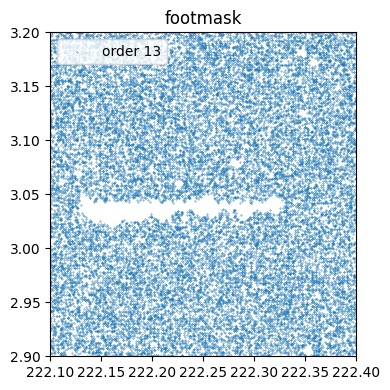
    
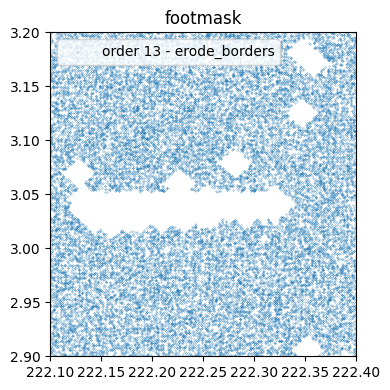

The large central hole is due to lack of coverage in one of HSC bands. It can be seen that eroding its borders will set its boundary pixels to off (i.e. False). This will result in less mismatch between randoms and real source data (after cutting sources by the mask), at the expense of larger empty zones.

As you can see, isolated empty pixels were also enlarged. Since in most cases these will be caused by small artifacts or faint stars, it would be worth to try to remove them first, and then erode the borders of the remaining holes. In any case, the brigth star mask (pixelized at a larger resolution) can later drill circles of an appropiate size

```python
mkp_isoerode = SkyMaskPipe()
mkp_isoerode.build_foot_mask(sources=sources, remove_isopixels=True, erode_borders=True)
```

    BUILDING FOOT MASK >>>>>>>>>>>>>>>>>>>>>>>>>>>>>>>>>>>>>>>>>>>>>>
        Order :: 13
    --- Pixelating HATS catalog
        ...removing isolated pixels...
    100%|█████████████████████████████████████████████████████████████████████| 1353948/1353948 [00:08<00:00, 154303.47it/s]
        ...eroding borders...
    100%|█████████████████████████████████████████████████████████████████████| 1362137/1362137 [00:06<00:00, 194644.83it/s]
    --- Foot mask area                         : 65.28033553962435


```python
mkp.plot(stage='footmask', nr=20_000_000, figsize=[4,4], clipra=[222.1,222.4], clipdec=[2.9,3.2],s=0.1)
plt.legend(["order 13"], loc='upper left');
mkp_isoerode.plot(stage='footmask', nr=20_000_000, figsize=[4,4], clipra=[222.1,222.4], clipdec=[2.9,3.2],s=0.05)
plt.legend(["order 13 - remove_iso & erode"], loc='upper left');
```
    
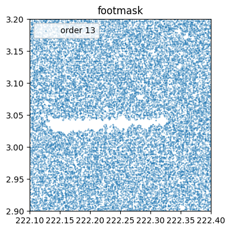

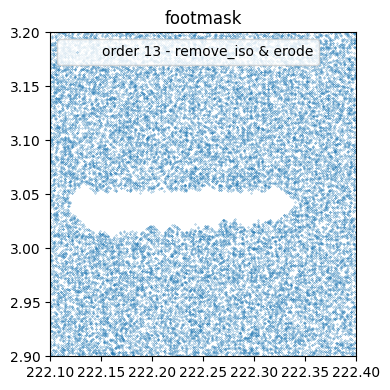
