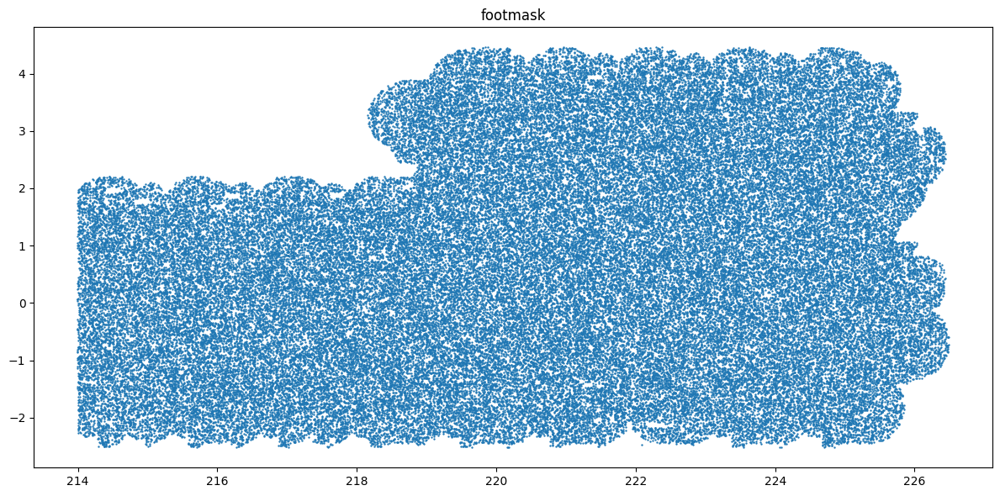
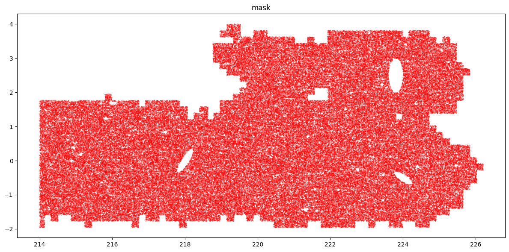
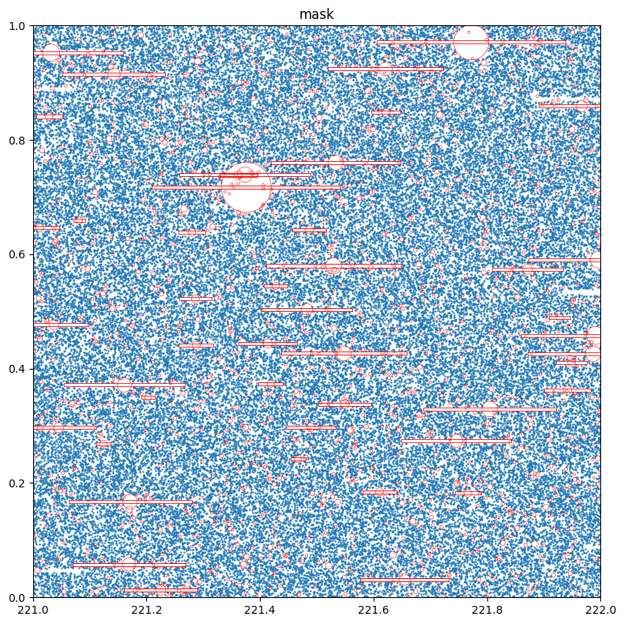
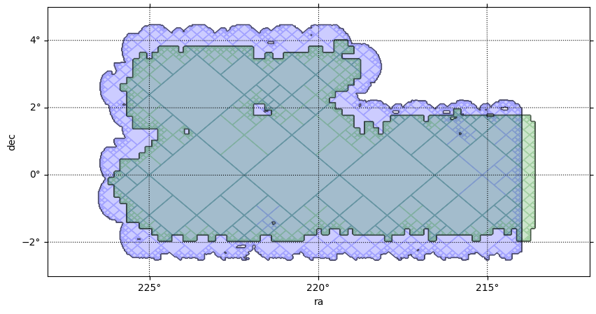
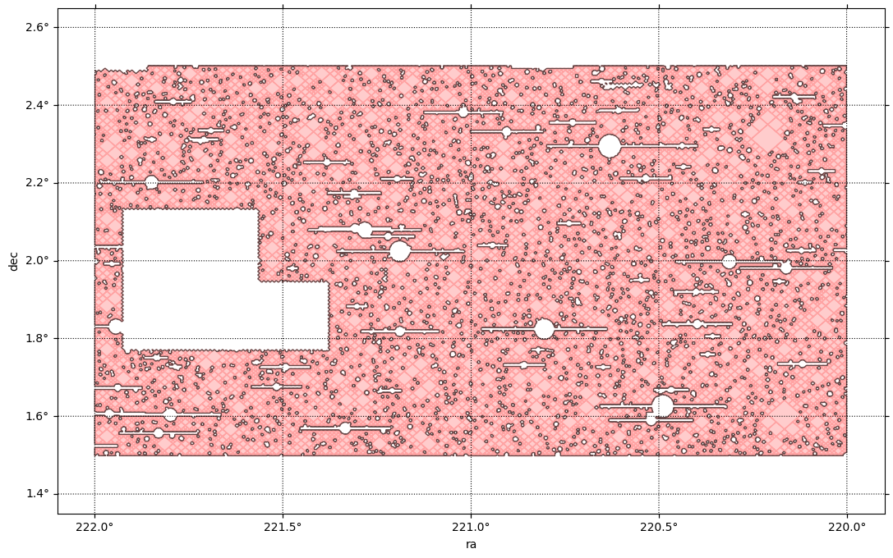
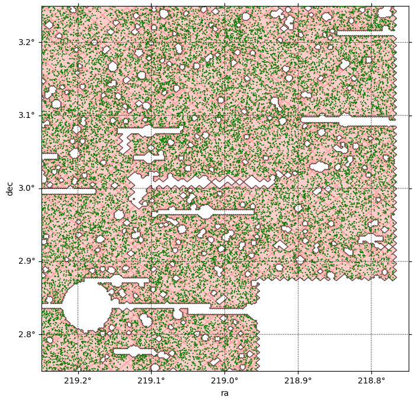
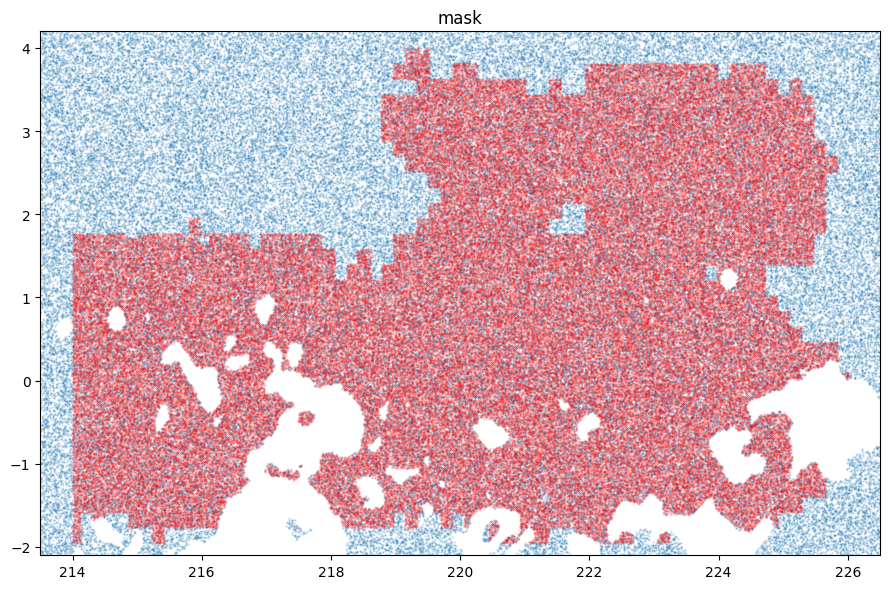

# How to swing a SkyKatana in Subaru HSC-SSP
<hr class='sep1'>
This example provides a guide for using <span class="sc">SkyKatana</span> to construct a mask for a small region of the HSC-SSP survey. It will help you to familiarize with key concepts, methods and serve as a model workflow for processing larger, more sophisticated masks.

The main class is called `:::py3 SkyMaskPipe`. After a pipeline is instantiated, you can add masks (a.k.a. maps) due to various effects. These masks are independent boolean (or bit-packed boolean) healsparse maps we call <span class="emph1">stages</span>. Stages are stored within the class along with some metadata and some typical stages are:

* <span class='st'>footmask</span> :: holds the footprint map created by pixelating discrete sources of a catalog
* <span class='st'>patchmask</span> :: holds the map created from HSC patches matching some criteria
* <span class='st'>propmask</span> :: mask created from the combination of multiple healsparse propery maps matching some criteria
* <span class='st'>circmask</span> :: mask created from a list of circular sources, usually stars 
* <span class='st'>boxmask</span> :: map created from a set of box regions 
* <span class='st'>ellipmask</span> :: map created from a set of elliptical regions

Once you have a few stages in the pipeline, their masks can be combined by <span class="met">combine()</span> into:

* <span class='st'>mask</span> :: mask generated from the logical combination of the maps above

## Example dataset
We have prepared a [small dataset](https://drive.google.com/file/d/1Fft9E9uD1eXs-8Dxb8bp5ou1bEtCTkgr/view?usp=sharing) of ~8 million HSC galaxies. It contains a HATS catalog and auxiliary input files used below. Download (170 MB), decompress it, and then adjust the folder location in `BASEPATH`. 

## Imports and input data files
We should start by importing `:::py3 SkyMaskPipe`, which is the main <span class="sc">Skykatana</span> class, along with some auxiliary packages.

```python
from skykatana import SkyMaskPipe
import matplotlib.pyplot as plt
from pathlib import Path
import astropy.units as u
from astropy.coordinates import SkyCoord
import lsdb          # if pixelating source catalogs in HATS format
```

Throughout this example, <span class="sc">SkyKatana</span> will read and pixelate discrete sources and many geometrical shapes. Concentrate their location paths here.

```python
# Base path of the example dataset 
BASEPATH = Path('../../skykatana_example_data/example_data/')
# Input HATS catalog (these are HSC galaxies)
HATSCAT = BASEPATH / 'hscx_minispring_gal/'
# Bright stars in HSC area
STARS_REGIONS     = BASEPATH / 'hsc_aux/stars_iband.parquet'
# Boxes around stars in HSC
BOX_STARS_REGIONS = BASEPATH / 'hsc_aux/starboxes_iband.parquet' 
# HSC patches and QA patch list. See here for details -> hsc-release.mtk.nao.ac.jp/schema/#pdr3.pdr3_wide.patch_qa
PATCH_FILE     = [BASEPATH / 'hsc_aux/tracts_patches_minispring.parquet']
QA_FILE        = BASEPATH / 'hsc_aux/patch_qa.csv'
# SFD dust extintion map (precut to the region covered in this example)
PROPMAP_FILE   = BASEPATH / 'hsc_aux/sfd_ebv_piece.fits'
# Some dummy geometrical regions
ELLIP_REGIONS       = BASEPATH / 'hsc_aux/extended_sources.dat'
USER_CIRCLE_REGIONS = BASEPATH / 'hsc_aux/user_circs.dat' 
USER_POLY_REGIONS   = BASEPATH / 'hsc_aux/user_polys.dat'
USER_ZONE_REGIONS   = BASEPATH / 'hsc_aux/user_zones.dat'
```

## 1. Instantiate and add a footprint stage
We choose an ouput sparse order now (though we can change it later) and create an empty SkyMaskPipe object `:::py3 mkp`. We will first add a footprint stage, i.e. a stage defined by the pixelization of the discrete sources in our HATS catalog.

```python
mkp = SkyMaskPipe(order_out=15)
mkp.build_foot_mask(sources=lsdb.open_catalog(HATSCAT), order_foot=13);
```
```

    BUILDING FOOT MASK >>>>>>>>>>>>>>>>>>>>>>>>>>>>>>>>>>>>>>>>>>>>>>
        Order :: 13
    --- Pixelating HATS catalog
    --- Foot mask area                         : 69.35790724770318
```

Note we selected a smaller order, as it is more compatible to produce a continuous coverage given the the density of sample. Every stage can be pixelized at different order and is only during combination that the ouput mask will be produced at `:::py3 order_out`. The result is a <span class="st">footmask</span> stage accesible as `:::py3 mkp.footmask`.

## 2. Add a second stage from HSC-SSP patches
The HSC-SSP survey is divided into "patches" which are the fundamental areal units that result from diving each tract into smaller ~12 arcmin side equi-area rectangular regions. A number of QA measurements are available per patch indicating for example the limiting psf magnitude in a given band. Create now a <span class="st">patchmask</span> stage after filtering out patches below a given depth threshold in gri bands.

```python
filt = "(gmag_psf_depth>26.2) and (rmag_psf_depth>25.9) and (imag_psf_depth>25.7)"
mkp.build_patch_mask(patchfile=PATCH_FILE, qafile=QA_FILE, filt=filt, order_patch=13);
```
```
    BUILDING PATCH MAP >>>>>>>>>>>>>>>>>>>>>>>>>>>>>>>>>>>>>>>>>>>
    --- Processing ../../skykatana_example_data/example_data/hsc_aux/tracts_patches_minispring.parquet
        Order :: 13
        Patches with QA                       : 3708
        Patches with QA fulfilling conditions : 2003
        Surviving patch pixels                : 1062650
    --- Patch mask area                           : 54.43575391135537
```

### Inspecting pipelines
Just typing `:::py3 mkp`  disaplays the list of stages stored in the pipeline, along with useful information such as coverage order/nside, sparse order/nside, number of valid pixels (e.g. `:::py3 True` pixels) and the pixel size at the sparse order. This is ultimately the resolution of the stage map.

```
    footmask       : (ord/nside)cov=4/16   (ord/nside)sparse=13/8192  valid_pix=1353948  area= 69.36 deg² pix_size=  25.8"
    patchmask      : (ord/nside)cov=4/16   (ord/nside)sparse=13/8192  valid_pix=1062650  area= 54.44 deg² pix_size=  25.8"
```

## 3. Add stages for bright stars
The effect of bright stars in HSC can be decomposed into circular shapes due to the bright halo of stars, and into rectangular boxes due to saturated bleed trails along the CCD. <span class="sc">SkyKatana</span> has methods to pixelize both, creating a <span class="st">circmask</span> and a <span class="st">boxmask</span> stage.

```python
mkp.build_circ_mask(data=STARS_REGIONS, fmt='parquet');
mkp.build_box_mask(data=BOX_STARS_REGIONS, fmt='parquet');
```
```
    BUILDING CIRCLES MASK >>>>>>>>>>>>>>>>>>>>>>>>>>>>>>>>>>>>>
    --- Pixelating circles from ../../skykatana_example_data/example_data/hsc_aux/stars_iband.parquet
        Order :: 15 | pixelization_threads=4
        Circles to pixelate: 223015 in batches of 600000
            processing circles 0:223015 ...
    --- Circles mask area                        : 12.277230882152068
    BUILDING BOXES MASK >>>>>>>>>>>>>>>>>>>>>>>>>>>>>>>>>>>>>>>>
    --- Pixelating boxes from ../../skykatana_example_data/example_data/hsc_aux/starboxes_iband.parquet
        Order :: 15
        done
    --- Boxes mask area                           : 5.564107952862163
```

## 4. Mask out extended sources
Large nearby galaxies and other extended objects will usually get deblended into multiple sources that get into large survey databases. Sometimes it is not straightforward to assign a single parent object so that, depending on your purposes, it could be more practical to just mask out an elliptical region around them. For didactic purposes, we will pixelize three huge dummy galaxies.

```python
mkp.build_ellip_mask(data=ELLIP_REGIONS, fmt='ascii');
```
```
    BUILDING ELLIPSES MASK >>>>>>>>>>>>>>>>>>>>>>>>>>>>>>>>>>>>>
    --- Pixelating ellipses from ../../skykatana_example_data/example_data/hsc_aux/extended_sources.dat
        Order :: 15
        done
    --- Ellipses mask area                        : 0.5414152216851591
```

## 5. Combine stages
Now combine into a "final" mask by intersecting <span class="st">footmask</span> with <span class="st">patchmask</span>, subtracting <span class="st">circmask</span>/<span class="st">boxmask</span> (e.g. due to stars), and <span class="st">ellipmask</span> (e.g. due to large galaxies). If maps have different geometry such as sparse or coverage order, they will be reprojected on the fly to allow combination. <span class="sc">SkyKatana</span> streaming algorithms allow fast reprojections of masks composed of billions of pixels in "harsh" low-memory environments of  
even 16GB RAM. We specify a list of positive areas (that we want to keep) and a list of negative areas (that we want to subtract).

```python
mkp.combine(positive=[('footmask','patchmask')], negative=['circmask','boxmask','ellipmask'], verbose=True);
```
```
    [combine] aligning coverage for 'footmask' : c4 → c4
    [combine] aligning coverage for 'patchmask' : c4 → c4
    [combine] aligning coverage for 'circmask' : c4 → c4
    [combine] aligning coverage for 'boxmask' : c4 → c4
    [combine] aligning coverage for 'ellipmask' : c4 → c4
    [combine] target=(o15, c4), work_order=13, r2=16
    [combine:&] group of 2 stages: orders=[13, 13] -> work 13
    [combine] done: order_out=15 (NSIDE=32768), order_cov=4 (NSIDE=16), valid_pix=14,312,202, area=45.823 deg², bit_packed=True
```

Inspect the pipeline and note now there is a new <span class="st">mask</span> stage.
```

    footmask       : (ord/nside)cov=4/16   (ord/nside)sparse=13/8192  valid_pix=1353948  area= 69.36 deg² pix_size=  25.8"
    patchmask      : (ord/nside)cov=4/16   (ord/nside)sparse=13/8192  valid_pix=1062650  area= 54.44 deg² pix_size=  25.8"
    circmask       : (ord/nside)cov=4/16   (ord/nside)sparse=15/32768 valid_pix=3834656  area= 12.28 deg² pix_size=   6.4"
    boxmask        : (ord/nside)cov=4/16   (ord/nside)sparse=15/32768 valid_pix=1737887  area=  5.56 deg² pix_size=   6.4"
    ellipmask      : (ord/nside)cov=4/16   (ord/nside)sparse=15/32768 valid_pix=169105   area=  0.54 deg² pix_size=   6.4"
    mask           : (ord/nside)cov=4/16   (ord/nside)sparse=15/32768 valid_pix=14312202  area= 45.82 deg² pix_size=   6.4"
```

<span class="met">combine()</span> can perform the **union** --specified between braquets []-- and the **intersection** --specified between parenthesis()-- of any stage specified in the positive group. For example, the following would intersect <span class="st">footmask</span> with <span class="st">patchmask</span>, join the result with <span class="st">zonemask</span> and subtract the three masks for circles, boxes and ellipses. 

```python
some_map = mkp.combine(positive=[('footmask','patchmask'),'zonemask'], negative=['circmask','boxmask','ellipmask'])
```

!!! note "Overwriting stages"

    All `:::py3 build_*` methods modify (and overwrite) its corresponding stage unless `:::py3 output_stage` is specified. 
    Independent of that, all `:::py3 build_*` methods also return the new stage so it can get assigned to any variable outside
    of the pipeline.


## 6. Generate randoms & apply mask to catalog
Before visualizing our pipeline, lets dive first into some applications. One of the most useful applications is generating random points uniformly distributed over the healpix pixels of a stage, e.g. to construct syntetic catalogs for computing two-point correlation functions. <span class="sc">SkyKatana</span> implements fast alogrithms that work without materializing the global valid-pixels list, enabling such computations with billion pixel masks.

Lets generate 1 million randoms over the <span class=st>mask</span> stage:
```python
rands = mkp.makerans(stage='mask', nr=1_000_000)
rands[:5]
```

<div><i>Table length=5</i>
<table id="table131738189210128" class="table-striped table-bordered table-condensed">
<thead><tr><th>ra</th><th>dec</th></tr></thead>
<thead><tr><th>float64</th><th>float64</th></tr></thead>
<tr><td>217.0317095518112</td><td>0.7331634065253888</td></tr>
<tr><td>224.5373511314392</td><td>3.0642220551410375</td></tr>
<tr><td>217.44206607341766</td><td>1.7395248080214378</td></tr>
<tr><td>221.71443343162534</td><td>1.0998600539612031</td></tr>
<tr><td>216.9879573583603</td><td>-1.1881555807593203</td></tr>
</table></div>


Of course you can use any stage stage, and also save the table in parquet format when `:::py3 file` is specified, e.g. `:::py3 file='ellip_randoms.parquet'`
```python
rands_in_holes = mkp.makerans(stage='ellipmask', nr=100_000, file='ellip_randoms.parquet')
rands_in_holes[:5]
```

<div><i>Table length=5</i>
<table id="table132356686266144" class="table-striped table-bordered table-condensed">
<thead><tr><th>ra</th><th>dec</th></tr></thead>
<thead><tr><th>float64</th><th>float64</th></tr></thead>
<tr><td>223.81314396858212</td><td>2.687722491092348</td></tr>
<tr><td>223.7549990415573</td><td>2.795585374635337</td></tr>
<tr><td>223.75130295753476</td><td>2.6220092843271305</td></tr>
<tr><td>223.80658864974973</td><td>2.18948552704603</td></tr>
<tr><td>223.62743854522705</td><td>2.3103729155855297</td></tr>
</table></div>


Another very relevant use of masks is returning the sources of a given catalog that fall inside. The <span class='met'>apply()</span> method is designed to do that.

```python
import lsdb
cat = lsdb.read_hats(HATSCAT, columns=['ra','dec']).compute()
srcs_masked = mkp.apply(stage='mask', cat=cat, columns=['ra','dec'])
```
```
    6014995 sources within mask
```

## 7. Saving/reading pipelines
Use <span class='met'>write()</span> to save a complete SkyMaskPipe object to disk. This will create a directory where each stage is saved in FITS format using bit-encoding compression, plus a JSON file holding various metadata. Once again, just plain dumping pixels to a hard drive would be very inefficient, so <span class="sc">SkyKatana</span> implements special compression algorithms that balance speed, memory usage and file size. For referece, a 0.5 billion pixel mask should be writen to disk in a few seconds, read back in under a minute, and occupy ~300 MB.


```python
mkp.write('../../skykatana_example_data/mask/minispring', overwrite=True)
```

When you need to read back a pipeline, use the <span class='met'>read()</span> method:
```python
mkp_readfromdisk = SkyMaskPipe.read('../../skykatana_example_data/mask/minispring')
```


## 8. Plotting and visualizing masks
The <span class='met'>plot()</span> method is suitable for very fast visualizations by plotting random (ra,dec) sources over a given stage

```python
mkp.plot(stage='footmask')
```



```python
# Plot the combined mask with 200k randoms
mkp.plot(stage='mask', nr=200_000, s=0.09, color='r')
```


Plot a zoom of <span class='st'>mask</span>, overlaying the circles and boxes associated to the stars masked out by passing `:::py3 plot_circles` and `:::py3 plot_boxes`. The `:::py3 clipra` and `:::py3 clipdec` parameters allow to specify a plotting window.  

```python
# Define two dictionaries with data files, format and column names
stars={'data':str(STARS_REGIONS), 'fmt':'parquet', 'columns':['ra','dec','radius']}
boxes={'data':str(BOX_STARS_REGIONS), 'fmt':'parquet', 'columns':['ra_c','dec_c','width','height']}
mkp.plot(stage='mask', nr=4_000_000, figsize=[8,8], clipra=[221,222], clipdec=[0,1], plot_circles=stars, plot_boxes=boxes)
```



While plotting randoms can be fast, if the mask is large we need to generate lots of randoms to reach an adequate density. Moreover, points are drawn respect to simple x-y cartesian axes. An alternative is to represent masks with their MOCs. A MOC (Multi-Order Coverage map) is a data structure that defines the coverage of complex sky regions by a series of disjoint healpix pixels of multiple resolutions. Using the great capabilities of mocpy, the method <span class='met'>plot_moc()</span> generates accurrate visualizations in WCS (World Coordinate System) axes with a variety of astronomical projections.

```python
center = SkyCoord(220*u.deg, 1*u.deg)   # specify the center of plot
fov    = 8 * u.deg                      # specify the field of view
fig, ax, wcs = mkp.plot_moc(stage='footmask', center=center, fov=fov, color='b') # MOC of footmask
fig, ax, wcs = mkp.plot_moc(stage='patchmask', ax=ax, wcs=wcs, color='g')        # MOC of patchmask
```
```
    Looking pixels...
    Found 1353948 pixels
    Creating display moc from pixels...
    MOC max_order is 13 --> degrading to 11...
    Drawing plot...
    Looking pixels...
    Found 1062650 pixels
    Creating display moc from pixels...
    MOC max_order is 13 --> degrading to 11...
    Drawing plot...
```


It can be readly seen above that keeping only the patches above a minimum deph has indeed discared the border areas of the survey, which are covered by less visits than the central areas and therefore do not reach the same depth after coaddition.

Now make zoom on a MOC. When zooming by selecting a smaller FOV, millions of high order pixels can show up and slow down plotting and/or consume large ammounts of memory. Use `:::py3 clipra`/`:::py3 clipdec` to specify a region of interest and avoid processing pixels outside the chosen display window.

```python
center = SkyCoord(221*u.deg, 2*u.deg)    # center of plot
fov    = [2.2*u.deg, 1.3*u.deg]          # field of view 
clipra = [220, 222]                      # ra limits for processing pixels
clipdec = [1.5, 2.5]                     # dec limits for processing pixels
fig, ax, wcs = mkp.plot_moc(stage='mask',  center=center, fov=fov,  color='r', clipra=clipra, clipdec=clipdec, figsize=[13,8])
```
```
    Looking pixels inside clip box...
    Found 504524 pixels
    Creating display moc from pixels...
    MOC max_order is 15 --> no degrading...
    Drawing plot...
```

    
At some point it might be desirable to plot actual sources to check where they fall respecto to a mask. Lets plot the MOC and overlay a catalog sources with <span class="met">plot_srcs()</span>. In this case we shall plot the sources we already applied <span class="st">mask</span> before. If math was correct, not a single source should lie outside the MOC.

```python
center = SkyCoord(219*u.deg, 3*u.deg)    # center of plot
fov    = [0.5*u.deg, 0.5*u.deg]          # field of view 
clipra = [218.5, 219.3]                  # ra limits for processing pixels
clipdec = [2.7, 3.5]                     # dec limits for processing pixels
fig, ax, wcs = mkp.plot_moc(stage='mask',  center=center, fov=fov,  color='r', alpha=0.2, clipra=clipra, clipdec=clipdec, figsize=[8,8])
fig, ax, wcs = mkp.plot_srcs(srcs_masked['ra'], srcs_masked['dec'], ax=ax, wcs=wcs, s=10, alpha=1, color='g', zorder=10)
```
```
    Looking pixels inside clip box...
    Found 99104 pixels
    Creating display moc from pixels...
    MOC max_order is 15 --> no degrading...
    Drawing plot...
```



## 9. Build methods: from geometry to masks
<span class="sc">Skykatana</span> has methods to pixelate and generate masks from a variety of geometric shapes.

```python
mkp.build_foot_mask(sources=lsdb.open_catalog(HATSCAT));                      # from individual point sources
mkp.build_prop_mask(prop_maps=PROPMAP_FILE,thresholds=1.3,comparisons='lt');  # from healsparse property maps
mkp.build_circ_mask(data=STARS_REGIONS, fmt='parquet');                       # from circular regions
mkp.build_box_mask(data=BOX_STARS_REGIONS, fmt='parquet');                    # from box regions
mkp.build_ellip_mask(data=ELLIP_REGIONS, fmt='ascii');                        # from elliptical regions
mkp.build_poly_mask(data=USER_POLY_REGIONS, fmt='ascii');                     # from quadrangular sky polygons
mkp.build_zone_mask(data=USER_ZONE_REGIONS, fmt='ascii');                     # from zones delimited by ra-dec boundaries
mkp.build_patch_mask(patchfile=PATCH_FILE, qafile=QA_FILE, filt=filt);        # from a sets of patches with custom filtering
```

Each the these `:::py3 build_*` methods store its calling arguments as dictionaries under `:::py3 _params`. In this way, all the metadata used to create each stage is saved in the pipeline and kept for record. Use <span class='met'>stage_meta()</span> to quickly access the metadada associated with a stage.

```python
mkp.stage_meta('footmask')
```

```
    {'sources': '../../skykatana_example_data/example_data/hscx_minispring_gal',
     'order_foot': 13,
     'order_cov': 4,
     'columns': ('ra', 'dec'),
     'remove_isopixels': False,
     'erode_borders': False,
     'bit_packing': True,
     'pixels': np.int64(1353948),
     'area_deg2': np.float64(69.35790724770318)}
```
In the simple example above, the command is equivalent to `:::py3 mkp._params['footmask']`. Access all dictionaries with `:::py3 mkp._params`.


## 10. Creating masks from property maps
While patches are geometric constructions specific to HSC, in general you can might also need to restrict to arbitrary areas meeting certain conditions. Surveys like Rubin produce **healsparse propery maps**, which track spatial information about the survey (e.g. observing conditions, depth, exposure time) in a dual healpix map constructed at coarse and sparse orders.

The map file below contains a small region of the dust extinction map of Schlegel, Finkbeiner & Davies in healsparse format. We impose and arbitrary cut to discard areas with very high extinction and intersect <span class='st'>footmask</span>, <span class='st'>patchmask</span> and <span class='st'>propmask</span>

```python
mkp.build_prop_mask(prop_maps=PROPMAP_FILE,thresholds=1.3,comparisons='lt')
mkp.combine(positive=[('footmask','patchmask','propmask')]);
```

```
    BUILDING PROPERTY MAP >>>>>>>>>>>>>>>>>>>>>>>>>>>>>>>>>>>>>
    --- Processing ../../skykatana_example_data/example_data/hsc_aux/sfd_ebv_piece.fits
    --- Propertymap coverage order changed to 4
    --- Propertymap sparse order changed to 15
    --- Propertymap mask area                       : 113.86116591708016
    [combine] aligning coverage for 'footmask' : c4 → c4
    [combine] aligning coverage for 'patchmask' : c4 → c4
    [combine] aligning coverage for 'propmask' : c4 → c4
    [combine] target=(o15, c4), work_order=13, r2=16
    [combine:&] group of 3 stages: orders=[13, 13, 15] -> work 13
    [combine] done: order_out=15 (NSIDE=32768), order_cov=4 (NSIDE=16), valid_pix=14,497,392, area=46.416 deg², bit_packed=True
```

Overlay the SFD extincion map in <span class='st'>propmask</span> and the new combined final mask

```python
fig, ax = plt.subplots(figsize=[9,6])
mkp.plot(stage='propmask', nr=200_000, alpha=0.2, clipra=[213.5, 226.5], clipdec=[-2.1,4.2], ax=ax)
mkp.plot(stage='mask', nr=200_000, s=0.09, color='r', alpha=0.3 , ax=ax)
```




## 11. Creating stages with custom names
All `:::py3 build_*` methods create a stage with a fixed name, e.g. <span class='st'>footmask</span>, <span class='st'>propmask</span>, <span class='st'>circmask</span>, etc. These area canonical names chosen to help structuring your pipleline, but <span class="sc">SkyKatana</span> 
is not rectricted in that aspect. You can add your own stages with any name (or origin) as long as they are valid healsparse 
boolean (or bit-packed boolean) masks. The `build_*` methods support an `:::py3 output_stage` keyword to specify stages with custom names, and they will also store on each call the corresponding dictionary with calling parameters under `:::py _params`.

Lets use <span class='met'>build_circ_mask()</span> to create bogus masks due to two different star catalogs and store them with custom names (do not excute the cells below unless you supply the input files).

```python
mkp.build_circ_mask(data='statcat1.parquet', fmt='parquet', output_stage = 'stars1_mask');
mkp.build_circ_mask(data='statcat2.parquet', fmt='parquet', output_stage = 'stars2_mask');
```
```
    stars1_mask       : (ord/nside)cov=4/16   (ord/nside)sparse=15/32768 valid_pix=3834656  area= 12.28 deg² pix_size=   6.4"
    stars2_mask       : (ord/nside)cov=4/16   (ord/nside)sparse=15/32768 valid_pix=1730710  area= 6.02 deg² pix_size=   6.4"
```

Lets create a bogus cirrus mask using plain mocpy, and add it to a pipeline:
```python
import healsparse as hsp, numpy as np
from mocpy import MOC
from astropy.coordinates import SkyCoord
moc = MOC.from_zone(SkyCoord([[220, -5], [222, 0.3]], unit="deg"), max_depth=15)
cirrus = hsp.HealSparseMap.make_empty(2**4, 2**15, dtype=np.bool_)
pixels = moc.flatten().astype(np.int64)
cirrus.update_values_pix(pixels, True)
cirrusmask = cirrus.as_bit_packed_map()

mkp.cirrusmask = cirrusmask
```
 
Then, you can work, combine and plot as with any other stage as normal.
```python
mkp.combine(positive=['footmask','patchmask','cirrusmask'], negative=['stars1_mask','stars2_mask','ellipmask']);
```

!!! note "Naming stages"

    Note that while any name is valid for a stage, only stages ending with **"mask"** show up when printing, e.g cirrusmask, 
    satellitemask, nebulamask, etc., and most `build_*` methods will only accept `:::py3 output_stage` names ending 
    with **"mask"**.

