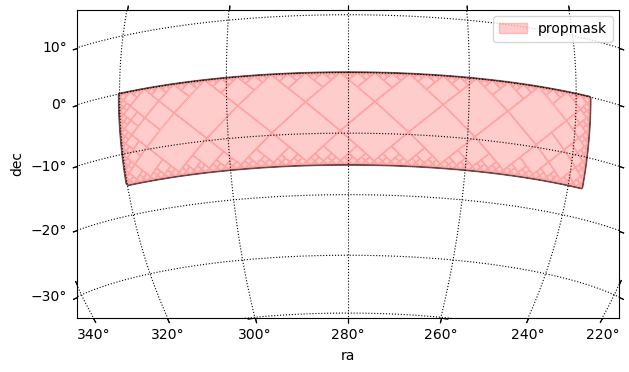
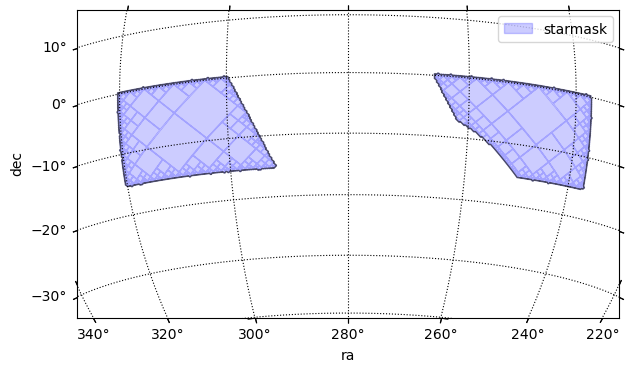
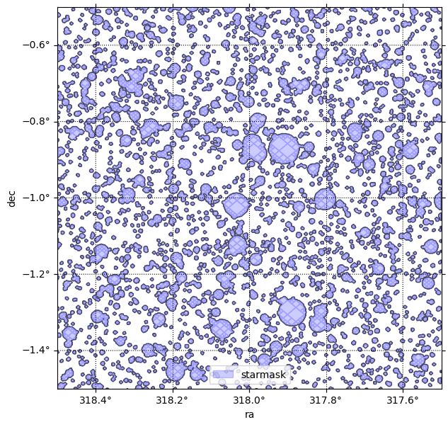
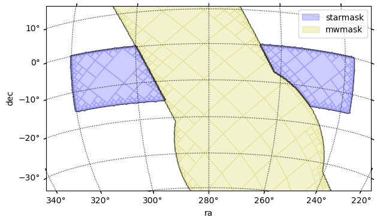
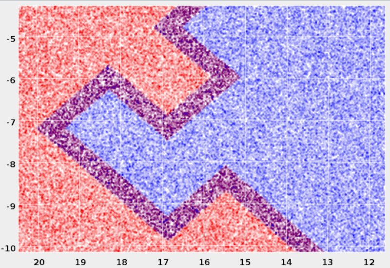
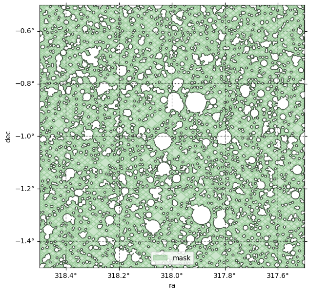
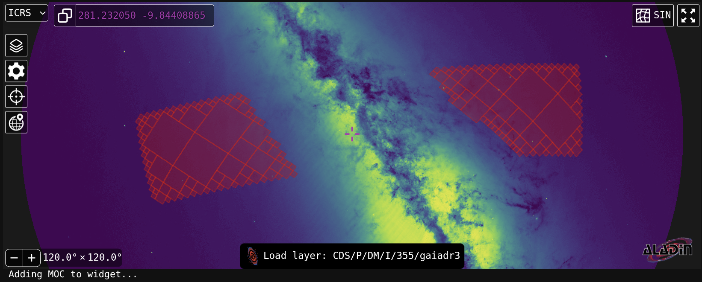
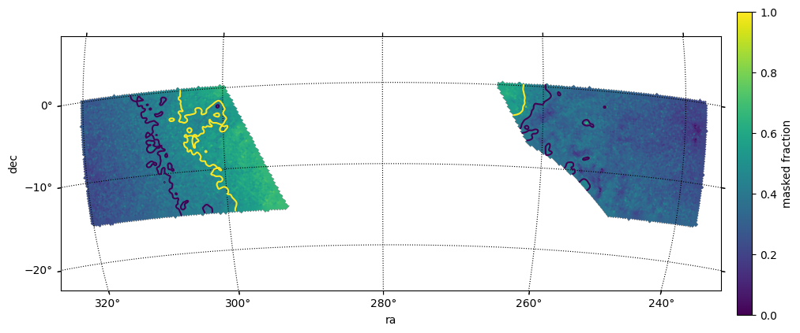
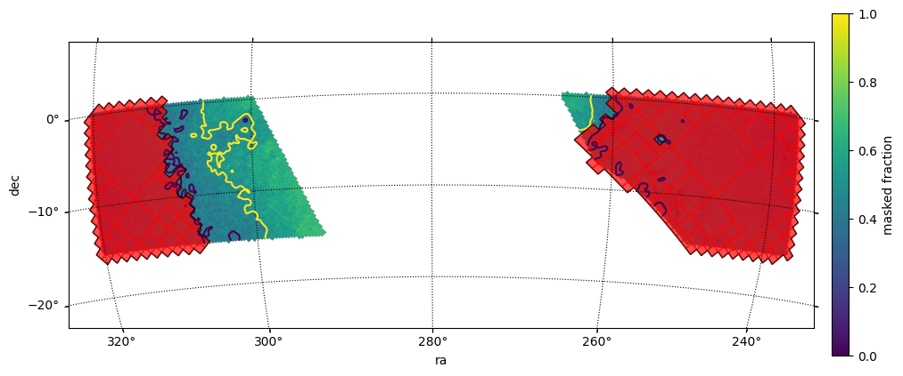
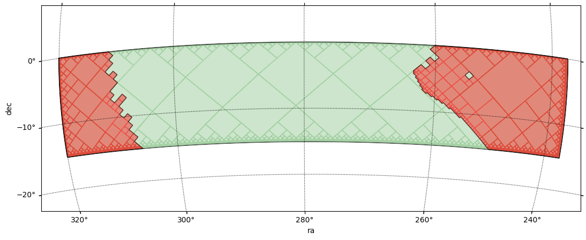

# Creating Star Masks for Rubin in RSP with Skykatana
<hr class='sep1'>
This example shows how to use <span class="sc">SkyKatana</span> to construct a mask due to bright stars for the Vera Rubin, by querying Gaia sources on-demand, calculating exclusion radii and pixelating circular shapes It is meant to be run in the Rubin Science Platform, although it will work anywhere as long as the catalog being queried is available in HATS/LSDB format.

The main class is called `:::py3 SkyMaskPipe`. After a pipeline is instantiated, you can add masks (a.k.a. maps) due to various effects. These masks are independent boolean (or bit-packed boolean) healsparse maps we call <span class="emph1">stages</span>. Stages are stored within the class along with some metadata and some typical stages are:

* <span class='st'>propmask</span> :: mask created from the combination of multiple healsparse propery maps matching some criteria
* <span class='st'>starmask</span> :: mask created from a list of circular sources, usually stars, queried catalogs like Gaia in HATS/LSDB format
* <span class='st'>mwmask</span> :: mask for the Milky Way plane and bulge, created to avoid attempting large queries in dense regions

Once you have a few stages in the pipeline, their masks can be combined by <span class="met">combine()</span> into:

* <span class='st'>mask</span> :: mask generated from the logical combination of the maps above

## Imports and input data files
We should start by importing `:::py3 SkyMaskPipe`, which is the main <span class="sc">Skykatana</span> class, along with some auxiliary packages.

```python
from skykatana import SkyMaskPipe
import matplotlib.pyplot as plt; from pathlib import Path
import astropy.units as u; from astropy.coordinates import SkyCoord
import lsdb
```

## 1. Define search area and create pipeline
First we have to define a seach area where to look for stars. While it can be any stage or boolean map, in Rubin it will be most likely some property map for example of coverage in a given band or total exposure time. For the following example, we create a fake search area out of a rectangle bound by ra-dec limits (zone), and store it in the <span class='st'>propmask</span> stage.


```python
# Create the MOC for a zone in the sky and get its pixels
ord_sparse   = 12
ord_coverage = 5 
moc = MOC.from_zone(SkyCoord([[237, -15], [320, 0]], unit="deg"), max_depth=ord_sparse)
pixels = moc.flatten().astype(np.int64)
# Create empty map and update its pixels
mapbool = hsp.HealSparseMap.make_empty(2**ord_coverage, 2**ord_sparse, dtype=np.bool_)
mapbool.update_values_pix(pixels, True)
# Instantiate the pipline and store in the propmask stage
mkp = SkyMaskPipe(order_out=15)
mkp.propmask = mapbool.as_bit_packed_map()
```

Just type the instance name (`:::py3 mkp`) to display useful information like orders, valid pixels, area, etc.
```
    propmask       : (ord/nside)cov=5/32   (ord/nside)sparse=12/4096  valid_pix=6015370  area=1232.58 deg² pix_size=  51.5"
```

And lets check how it looks in the sky
```python
center = SkyCoord(280*u.deg, -15*u.deg)  ;  fov = 50*u.deg
fig, ax, wcs = mkp.plot_moc(stage='propmask', center=center, fov=fov, figsize=[7,4], label='propmask', color='r')
plt.legend();
```
```
    Retrieving pixels...
    Found 6015370 pixels
    Creating display moc from pixels...
    MOC max_order is 12 --> degrading to 8...
    Drawing plot...
```

    

## 2. Define radius function and star query dictionary
Now, we define the <span class='emph1'>radius function</span> that will assign an exclusion radius around the stars. This function, which will passed to SkyKatana, can be completely customized with the only requirement that it must take an input dataframe (e.g. with star magnitudes) and add a "radius" column (in deg) with finite positive values for each row element. In the short example below, <span class='met'>radfunction()</span> can be customized according to completeness level and desired Rubin band.

```python
def radfunction(df: pd.DataFrame, **kwargs):
    mag = 'phot_g_mean_mag'                          # define magnitude to use
    band = kwargs.get('band', 'r')                   # extract band
    completeness = kwargs.get('completeness', 0.85)  # extract completeness level
    if band == 'r':
        if completeness==0.85:
            nconst, alpha = (1234.7,-0.28)  # normalization constant and exponential slope alpha
            magcut        =  17.19          # magnitude cutoff above which stars get a fixed faint_radius
            faintrad      =  10.2           # faint radius [arcsec]
        elif completeness==0.90:
            nconst, alpha = (1318.6,-0.28)  # normalization constant and exponential slope alpha
            magcut        =  17.24          # magnitude cutoff above which stars get a fixed faint_radius
            faintrad      =  10.8           # faint radius [arcsec]
    # Set radius
    df['radius'] = np.where(df[mag] <= magcut, nconst*np.exp(alpha*df[mag])/3600., faintrad/3600.)
```

Passing <span class='met'>radfunction()</span> as an input argument, enables to completely redefine the radii assigned to stars according to different criteria, while still taking advantage of efficient search and pixelization capabilities of <span class="sc">SkyKatana</span>.

Now we define the <span class='emph1'>star query dictionary</span>. This controls where and which stars will be queried, as well as some performance parameters to keep memory usage under control. If the search area is large, Skykatana can break it into chunks of healpix pixels that are queried, processed and coadded at the end, thus enabling the procesing of thousands of deg<sup>2</sup>.

```python
starq = {'search_stage': mkp.propmask,                 # The stage where we want to retrieve stars
         'cat':"https://data.lsdb.io/hats/gaia_dr3",   # URL of HATS catalog, e.g. for Gaia
         'columns':['ra','dec','phot_g_mean_mag'],     # Columns to retrieve from it
         'gaia_gmag_lims':[7,18],                      # G_band magnitude limits
         'radfunction': partial(radfunction, completeness=0.85, band='r'),  # Star radius function. Must be wrapped with partial()
         'avoid_mw': True,                             # Avoid Milky Way plane & bulge
         'b0_deg': 15.,                                # Mikly Way plane zone of exclusion from -b to b (deg)
         'bulge_a_deg': 25.,                           # Milky Way bulge semimajor axis length (deg)  
         'bulge_b_deg': 20.,                           # Milky Way bulge semiminor axis length (deg)
         'max_area_single': 400.,                         # Optional - max area to make in a single query
         'target_chunk_area': 400.,                       # Optional - target area of chunks that the search_stage is splitted into
         'coarse_order_bfs': 5                            # Optional - coarse order to perform chunking
         }
```

Large-scale queries might accidentally go deep into the Milky Way plane or bulge, stressing database systems and leading to memory issues or failed searches. To prevent this, when `:::py3 avoid_mw=True` SkyKatana will create a MOC map of the galaxy following the parameters provided for the plane band and (elliptical) bulge, and subtract it <span class='emph1'>before</span> searching for stars. In addition, the galaxy mask will get stored in <span class='st'>mwmask</span>, in case you need to combine it with other stages.

!!! Note "Stars retrieved"

    Note that the stars returned will always follow the search stage minus the galaxy mask, if chosen so, but the search stage in the pipeline remains 
    untouched. Subtract <span class='st'>mwmask</span> from any stage, when needed.


## 3. Search stars, construct its mask and plot
Before searching, we should start the Dask client to set the number of workers and memory resources.

```python
from dask.distributed import Client
client = Client(n_workers=3, threads_per_worker=1, memory_limit="6GiB")
```

We have everything ready. Just choose the orders for pixelization and run

```python
mkp.build_star_mask_online(starq=starq, order_sparse=15, order_cov=5, n_threads=1);
```
```
    BUILDING STAR MASK >>>>>>>>>>>>>>>>>>>>>>>>>>>>>>>>>>>>>
    --- Avoid Milky Way is ON
    Area of search_stage (MW subtracted) is 701.12 deg2 -> splitting...
    Got 3 chunks of areas [367.98  26.18 362.57] deg²
    Chunk 1/3: querying catalog ...
    --- Stars found : 1993677
    --- Pixelating circles from DataFrame
        Order :: 15 | pixelization_threads=1
        Circles to pixelate: 1993677 in batches of 600000
            processing circles 0:600000 ...
            processing circles 600000:1200000 ...
            processing circles 1200000:1800000 ...
            processing circles 1800000:1993677 ...
    Chunk 2/3: querying catalog ...
    --- Stars found : 236614
    --- Pixelating circles from DataFrame
        Order :: 15 | pixelization_threads=1
        Circles to pixelate: 236614 in batches of 600000
            processing circles 0:236614 ...
    Chunk 3/3: querying catalog ...
    --- Stars found : 1430598
    --- Pixelating circles from DataFrame
        Order :: 15 | pixelization_threads=1
        Circles to pixelate: 1430598 in batches of 600000
            processing circles 0:600000 ...
            processing circles 600000:1200000 ...
            processing circles 1200000:1430598 ...
    Milky Way mask stored in stage -> mwmask
    --- Star mask area                         : 255.8467114964821
```

Verify a new stage <span class='st'>starmask</span> has been created and check how it looks. It is clear that the empty zone at ra=~280 deg is due to the Milky Way mask.
```python
mkp
```
```
    propmask       : (ord/nside)cov=5/32   (ord/nside)sparse=12/4096  valid_pix=6015370  area=1232.58 deg² pix_size=  51.5"
    starmask       : (ord/nside)cov=5/32   (ord/nside)sparse=15/32768 valid_pix=79910864  area=255.85 deg² pix_size=   6.4"
    mwmask         : (ord/nside)cov=5/32   (ord/nside)sparse=8 /256   valid_pix=209658   area=10997.79 deg² pix_size= 824.5"
```

```python
center = SkyCoord(280*u.deg, -15*u.deg)  ;  fov = 50*u.deg
fig, ax, wcs = mkp.plot_moc(stage='starmask', center=center, fov=fov, figsize=[7,4], label='starmask', color='b')
plt.legend();
```
```
    Retrieving pixels...
    Found 79910864 pixels
    Creating display moc from pixels...
    MOC max_order is 15 --> degrading to 8...
    Drawing plot...
``` 

    
Make a zoom to clearly see what the mask is made of. Use a smaller field of view and, <span class='emph1'>very important</span>, clip the data outside the viewing regions to increase performance.

```python
center = SkyCoord(318*u.deg, -1*u.deg)  ;  fov = 1*u.deg
clipra  = [318-0.5, 318+0.5]
clipdec = [-1-0.5, -1+0.5]
fig, ax, wcs = mkp.plot_moc(stage='starmask', center=center, fov=fov, figsize=[7,7], label='starmask', color='b',
                            clipra=clipra, clipdec=clipdec)
plt.legend();
```
```
    Retrieving pixels inside clip box...
    Found 90576 pixels
    Creating display moc from pixels...
    MOC max_order is 15 --> no degrading...
    Drawing plot...
```    
    

there is also new stage <span class='st'>mwmask</span> due to the Milky Way.

```python
center = SkyCoord(280*u.deg, -15*u.deg)  ;  fov = 50*u.deg
fig, ax, wcs = mkp.plot_moc(stage='starmask', center=center, fov=fov, figsize=[7,4], label='starmask', color='b')
fig, ax, wcs = mkp.plot_moc(stage='mwmask', center=center, fov=fov, ax=ax, wcs=wcs, label='mwmask', color='y')
plt.legend();
```
```
    Retrieving pixels...
    Found 79910864 pixels
    Creating display moc from pixels...
    MOC max_order is 15 --> degrading to 8...
    Drawing plot...
    Retrieving pixels...
    Found 209658 pixels
    Creating display moc from pixels...
    MOC max_order is 8 --> no degrading...
    Drawing plot...
``` 



### Saving stars
<span class="sc">Skykatana</span> can also save the stars queried by setting <span class='icode'>save_stars=True</span>. This will save the stars of each chunk (with radius added) as a series of files named stars_chunk_01.parquet, stars_chunk_02.parquet, stars_chunk_03.parquet, etc.

Note however there will be repeated stars. This is because by construction the MOCs of each part are enlarged along their borders to include the effect of stars slighly outside their own area. If you need a unique list, apply a simple deduplication algorithm by ra-dec position.




## 4. Combine and save to disk
In <span class="sc">Skykatana</span>, the <span class='met'>combine()</span> method can easily subtract the area vetted by bright star from the input <span class='st'>propmask</span>. Note we also subtract  <span class='st'>mwmask</span> to mask out the galaxy in our original stage. The resulting <span class='st'>mask</span> stage now holds the "postive" area remaining.

```python
mkp.combine(positive=['propmask'], negative=['starmask', 'mwmask'], order_out=15, order_cov=5);
```
```
    [combine] aligning coverage for 'propmask' : c5 → c5
    [combine] aligning coverage for 'starmask' : c5 → c5
    [combine] aligning coverage for 'mwmask' : c5 → c5
    [combine] target=(o15, c5), work_order=12, r2=64
    [combine:+] stage at order 12 -> work 12
    [combine] done: order_out=15 (NSIDE=32768), order_cov=5 (NSIDE=32), valid_pix=136,180,886, area=436.004 deg², bit_packed=True
```
```python
mkp
```
```
    propmask       : (ord/nside)cov=5/32   (ord/nside)sparse=12/4096  valid_pix=6015370  area=1232.58 deg² pix_size=  51.5"
    starmask       : (ord/nside)cov=5/32   (ord/nside)sparse=15/32768 valid_pix=79910864  area=255.85 deg² pix_size=   6.4"
    mwmask         : (ord/nside)cov=5/32   (ord/nside)sparse=8 /256   valid_pix=209658   area=10997.79 deg² pix_size= 824.5"
    mask           : (ord/nside)cov=5/32   (ord/nside)sparse=15/32768 valid_pix=136180886  area=436.00 deg² pix_size=   6.4"
```

Lets check this combined mask by plotting a zoomed MOC

```python
center = SkyCoord(318*u.deg, -1*u.deg)  ;  fov = 1*u.deg
clipra  = [318-0.5, 318+0.5]
clipdec = [-1-0.5, -1+0.5]
fig, ax, wcs = mkp.plot_moc(stage='mask', center=center, fov=fov, figsize=[7,7], label='mask', color='g',
                            clipra=clipra, clipdec=clipdec)
plt.legend();
```
```
    Retrieving pixels inside clip box...
    Found 223192 pixels
    Creating display moc from pixels...
    MOC max_order is 15 --> no degrading...
    Drawing plot...
``` 


Since we are happy with the results, save the pipeline to disk with <span class='met'>write()</span>. This will create a directory where each stage is saved in FITS format using bit-encoding compression, plus a JSON file holding various metadata.

```python
mkp.write(outdir='./rubin_mask', overwrite=True)
```

## 5. Interactive plots
<span class="sc">Skykatana</span> can also generate interactive plots of mask MOCs, by leveraging the capabilities of the <a href="https://github.com/cds-astro/ipyaladin" target="_blank">ipyaladin widget</a> available for Jupyter.

In this example, we overlay our <span class='st'>starmask</span> over the Gaia density map. The starmask is degraded to order 13 at the expense of washing out small circles, but this is important to speed up large-scale visualizations. Note how the search has indeed avoided the galactic plane and bulge because we set <span class='icode'>avoid_mw=True</span>.

```python
alawidget = mkp.plot_moca(mkp.mask, order_forced=13)
```
Below is screen capture of the widget you should be seeing, with the mask MOC loaded.



You can continue adding stages to the same widet with <span class='met'>add_moca()</span>.

!!! Note "High orders and interactive visualizations"

    It is not recommended to attemp interactive visualizations of very large masks (thousands of sq degrees) with high orders (15-16), as the widget will
    receive a huge MOC and might become unresponsive. Best practice is to force a low order first, and then rise it untill results are statisfactory.


## 6. Fractional area maps
When investigating the effect of stars and other sources, a useful statistical measure is the fractional area masked out. That is, for a given order, the fractional area is the fraction of sparse pixels masked by those objects. For example, in dense regions near the galatic plane the number of pixels "occupied" by stars can be so high that this fraction can evan approach a value of one. In constrast, zones away from crowded stellar fields are expected to show a much lower fraction.

Healsparse provides a very efficient method to estimate these fractions. Based on it, <span class="sc">Skykatana</span> implements a convenient method (<span class='met'>frac_area_map()</span>), that optionally replaces the pixel around edges, which by construction
have sistematically lower fractions, by local harmonic average values. The result is a map whose (floating point) values are between 0 and 1. For visualiztion, <span class='met'>plot_fracmap()</span> can automatically calculate the fractional map of any stage, generate its 2D image representation, and overlay it over a WCS axes with optional contour levels.

Lets create the fractional map of our <span class='st'>starmask</span> at order 8, which means the fraction is considered over pixels of about 14 arcmin size.

```python
center = SkyCoord(279*u.deg, -10*u.deg)  ;  fov = 31*u.deg
fig, ax, wcs, im, cs = mkp.plot_fracmap(stage='starmask', center=center, fov=fov, figsize=[13,5], order_frac=8, avg_edges=True, 
                                        thresholds=[0.4,0.5], contour_smooth={'method':'gaussian', 'sigma_pix':3.0})
```
```
    Fractions at edge pixels are being averaged
    Fractional area map created at order 8: 13921 valid pixels
```

    
!!! Note "Tip for interactive display"

    If you install and enable the ipympl interative Jupyter backend, hovering the mouse over the image will show interactively the value of the
    fractional map.

Once you find a threshold suitable for the purposes of your mask, just use <span class='met'>build_prop_mask()</span> to construct it.

```python
frac = SkyMaskPipe.frac_area_map(mkp.starmask, order_frac=6, avg_edges=True)
mkp.build_prop_mask(prop_maps=[frac],thresholds=[0.4],comparisons=['lt'],output_stage='goodmask', order_sparse=6, order_cov=5)
```
```
    Fractions at edge pixels are being averaged
    Fractional area map created at order 6: 985 valid pixels
    BUILDING PROPERTY MAP >>>>>>>>>>>>>>>>>>>>>>>>>>>>>>>>>>>>>
    --- Propertymap mask area                       : 578.273321550494
```

And visualize everthing together

```python
center = SkyCoord(279*u.deg, -10*u.deg)  ;  fov = 31*u.deg
fig, ax, wcs, im, cs = mkp.plot_fracmap(stage='starmask', center=center, fov=fov, figsize=[13,5], order_frac=8, avg_edges=True, 
                                        thresholds=[0.4,0.5], contour_smooth={'method':'gaussian', 'sigma_pix':3.0})
fig, ax, wcs = mkp.plot_moc(stage='goodmask', center=center, fov=fov, ax=ax, wcs=wcs, color='r', alpha=0.7, order_force=6)
```
```
    Fractions at edge pixels are being averaged
    Fractional area map created at order 8: 13921 valid pixels
    Retrieving pixels...
    Found 689 pixels
    Creating display moc from pixels...
    MOC max_order is 6 --> degrading forcedly to 6...
    Drawing plot...
``` 


Refine this mask a little more. We went down in order to take advantage of the averaging, so lets go back to the order of the search stage.

```python
mkp.change_sparse_order(stage='goodmask', order=12, inplace=True)
```
```
    [change_sparse_order] goodmask requested upgrade o6 → o12
    [change_sparse_order] goodmask done: o12 (NSIDE=4096), cov=o5, n_valid=2,822,144, encoding=bool
```

And intersect this <span class='st'>goodmask</span> with the search stage while subtracting the Milky Way mask. This will get rid of the peaks of the coarser fractional map around the edges while preserving a "smooth" trasition across the threshold boundary.

```python
mkp.combine(positive=[('propmask','goodmask')], negative=['mwmask'], order_out=12, order_cov=5, output_stage='bettermask')
```
```
    [combine] aligning coverage for 'propmask' : c5 → c5
    [combine] aligning coverage for 'goodmask' : c5 → c5
    [combine] aligning coverage for 'mwmask' : c5 → c5
    [combine] target=(o12, c5), work_order=12, r2=1
    [combine:&] group of 2 stages: orders=[12, 12] -> work 12
    [combine] done: order_out=12 (NSIDE=4096), order_cov=5 (NSIDE=32), valid_pix=2,344,698, area=480.442 deg², bit_packed=True
```

```python
center = SkyCoord(279*u.deg, -10*u.deg)  ;  fov = 31*u.deg
fig, ax, wcs = mkp.plot_moc(stage='propmask', center=center, fov=fov, figsize=[13,5], color='g', order_force=12)
fig, ax, wcs = mkp.plot_moc(stage='bettermask', ax=ax, wcs=wcs, color='r', alpha=0.4, order_force=12)
```
```
    Retrieving pixels...
    Found 6015370 pixels
    Creating display moc from pixels...
    MOC max_order is 12 --> degrading forcedly to 12...
    Drawing plot...
    Retrieving pixels...
    Found 2344698 pixels
    Creating display moc from pixels...
    MOC max_order is 12 --> degrading forcedly to 12...
    Drawing plot...
``` 

    
